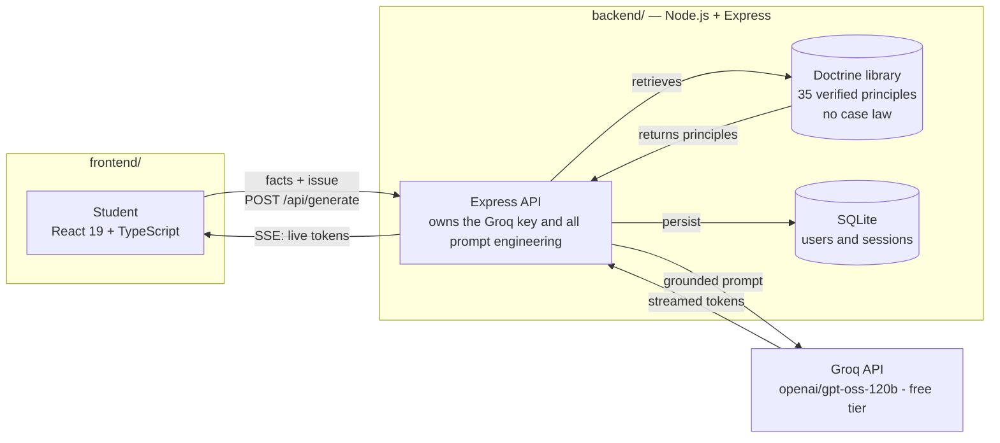

# Nyaya-AI

**AI Court / Legal Brief Simplification and Argument Drafting Assistant** — an educational web app that helps law students practice moot court and legal writing: paste in case facts, get a structured IRAC practice argument, stress-test it against an AI-generated opposition, and translate dense legal reasoning into plain language.

> Educational practice tool only. Not legal advice. All output references general legal principles/doctrines only — the AI is explicitly instructed to never fabricate case names or citations.

## Features

| Area | What it does |
|---|---|
| Case facts input | Text area for facts + legal issue, with subject (7 areas) and jurisdiction selectors, plus one-click sample scenarios |
| IRAC argument generation | Issue → Rule → Application → Conclusion, citing only general doctrines, streamed live token-by-token from the model |
| Retrieval-augmented grounding | Before generating, the backend retrieves relevant entries from a curated knowledge base of real general legal doctrines (`backend/src/data/legalPrinciples.json`) and grounds the prompt with them — never case law, so it strengthens accuracy without adding hallucination risk |
| Counterargument mode | Generates the opposition's strongest arguments, weaknesses in the student's position, and rebuttal directions |
| Plain-language explainer | Rewrites any legal reasoning for a first-year law student, with defined key terms and preserved nuance |
| Argument strength scoring | Informal AI feedback (1–10) on how well-structured and persuasive a generated argument is, with strengths and improvement suggestions |
| Authentication | Real accounts (bcrypt-hashed passwords, JWT sessions) plus a "1-Click Instant Access" anonymous guest session — both are genuine backend-verified sessions, not a client-side facade |
| Persistent disclaimer | Always-visible educational-only banner across the app |
| Export | Copy as Markdown, download as `.txt`, or export a formatted PDF brief |
| Session history | Server-persisted per-user history (SQLite) for both registered and guest accounts, with a `localStorage` fallback only if the backend is genuinely unreachable |
| Resilient demo mode | If the backend or API key is unavailable, the app transparently falls back to realistic mock output rather than breaking |
| Dark / light mode | Theme toggle on the Auth and Workspace screens (persisted to `localStorage`) |

Remaining stretch features from the original spec (multi-round debate simulation, voice input, jurisdiction/subject templates) were intentionally **not** built, to keep the implemented legal subject areas polished rather than spreading thin across "all of law."

## Architecture



*(GitHub renders this diagram automatically — if you're reading this elsewhere, the flow is: browser → Express backend → \[grounds the prompt via the doctrine library, then\] → Groq, with tokens streamed back live and every session persisted to SQLite.)*

- The frontend never calls Groq directly — the backend holds the API key and owns all prompt engineering.
- Every backend response is validated JSON matching the exact TypeScript shapes in `frontend/src/types/legal.ts`.
- If the backend is unreachable, returns an error, or the API key isn't configured, `frontend/src/services/api.ts` transparently falls back to local mock data (`services/mockData.ts`) so the UI is always usable in a demo/offline setting.
- `/api/generate` supports true token-level streaming: the client opts in with `{ stream: true }` and receives `text/event-stream` chunks (`event: delta` as tokens arrive, `event: complete` with the final parsed JSON) instead of waiting for the whole response — see `backend/src/groqClient.js#streamGroqJson` and `frontend/src/services/api.ts#generateArgumentStream`.
- Users and session history live in a real embedded SQLite database (`backend/src/db.js`, via Node's built-in `node:sqlite` — no extra dependency), not flat files — see [Authentication & storage](#authentication--storage) below.

## Anti-hallucination design

The single biggest risk called out in the original spec is the model inventing fake case citations. The backend's system prompt (`backend/src/prompts.js`) hard-codes:

- Only general legal principles/doctrines may be referenced (e.g. "offer-acceptance-consideration", "the reasonable person standard") — never a specific case name, statute section, or citation.
- Strict JSON-only output matching a fixed schema, enforced further by Groq's JSON response mode.
- A first-year-law-student register: precise but not needlessly dense.
- Retrieval-augmented grounding (`backend/src/retrieval.js`) pulls relevant entries from a small curated, hand-verified knowledge base of *general* doctrines before generation, so the model is steered toward real, checkable principles instead of free-associating names — the knowledge base intentionally contains no case law, so retrieval can never introduce a fabricated citation.

## Authentication & storage

- Real accounts: `POST /api/auth/signup` / `/api/auth/login` — passwords hashed with bcrypt, sessions issued as JWTs (`backend/src/auth.js`).
- Guest accounts: `POST /api/auth/guest` issues a real, backend-verified anonymous session (no email/password) so the "1-Click Instant Access" button never has to fake a login — it just skips registration. Guest and registered sessions go through the exact same `/api/sessions` storage, so there's no separate "demo data" code path to keep in sync.
- Storage is a real embedded SQLite database (`backend/data/nyaya.sqlite`, gitignored), not hand-rolled JSON files — `users` and `sessions` tables with proper indexes and a composite `(id, userId)` primary key on sessions so one user's session id can never collide with or overwrite another user's row. No artificial row cap.
- `localStorage` is used only as a last-resort client-side fallback if a guest login itself fails offline — not the primary storage mechanism.

## Getting started

### 1. Backend

```bash
cd backend
npm install
cp .env.example .env
# then edit .env and set GROQ_API_KEY (free key: https://console.groq.com/keys)
npm start          # listens on http://localhost:8000
```

### 2. Frontend

```bash
cd frontend
npm install
npm run dev         # http://localhost:5173 (or next free port)
```

The Vite dev server proxies `/api/*` to `http://localhost:8000` (see `frontend/vite.config.ts`), so no extra frontend configuration is needed.

## Tests

```bash
cd backend  && npm test   # node's built-in test runner — auth, sessions, RAG retrieval, prompt-building, input validation
cd frontend && npm test   # vitest — export/formatting utilities, mock scoring
```

## Tech stack

- **Frontend:** React 19, TypeScript, Vite, Tailwind CSS v4, lucide-react, jsPDF
- **Backend:** Node.js, Express, Groq API (`openai/gpt-oss-120b`, free tier), bcryptjs, jsonwebtoken
- **Persistence:** SQLite via Node's built-in `node:sqlite` (no extra dependency, no native build step) — `backend/data/nyaya.sqlite`
- **Testing:** Node's built-in test runner (backend), Vitest (frontend)

## Environment variables (`backend/.env`)

| Variable | Required | Notes |
|---|---|---|
| `GROQ_API_KEY` | Yes | Free key from console.groq.com/keys |
| `GROQ_MODEL` | No | Defaults to `openai/gpt-oss-120b` |
| `JWT_SECRET` | No | Signs login session tokens; a random one is generated per process start if unset (fine for dev, but sessions won't survive a restart) |
| `PORT` | No | Defaults to `8000`; must match the Vite proxy target |
| `CORS_ORIGIN` | No | Only needed for a production deployment with a separate frontend origin |
